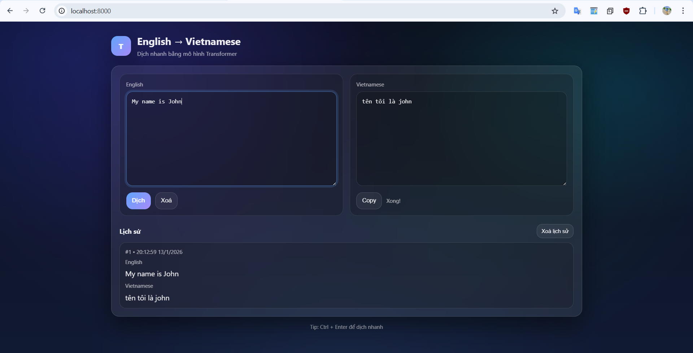
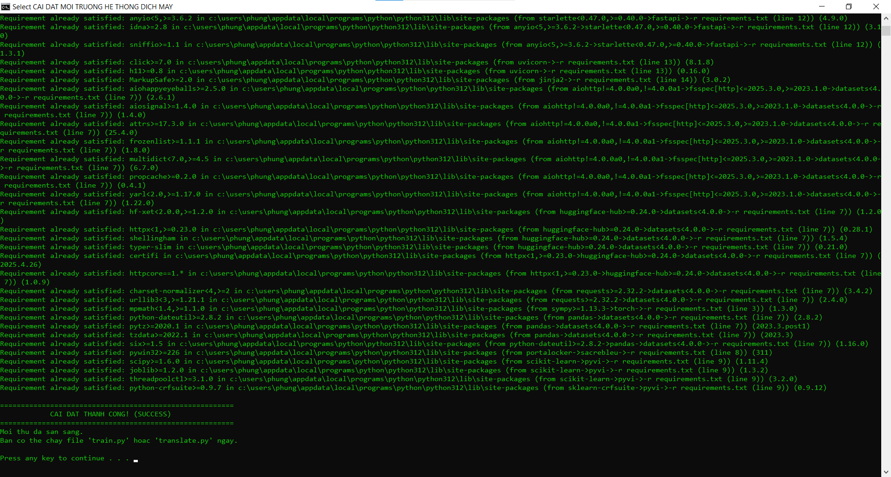
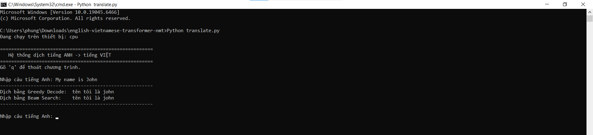
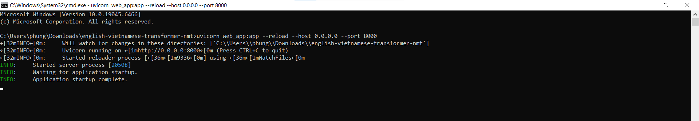

# A Transformer - Based Neural Machine Translation System for English – Vietnamese



A complete **Neural Machine Translation (NMT)** system that translates **English to Vietnamese**, built **from scratch** using the **Transformer architecture** in PyTorch.

This project supports both **Console translation** and a **modern Web interface** for real-world usage.

---

## 🔍 Overview

- **Language**: Python 3.10+
- **Model**: Transformer (from scratch)
- **Framework**: PyTorch
- **Authors**: Phùng Phúc Hậu & Phạm Trí Hùng

### ✨ Features
- Greedy Decoding (fast inference)
- Beam Search (higher translation quality)
- Transformer Encoder–Decoder implemented from scratch
- Web UI using FastAPI
- Easy installation with Windows `.bat` scripts

---

## 🧠 What I Learned From This Project

Through this project, I gained hands-on experience in:

- Implementing **Transformer architecture from scratch** (without using HuggingFace models)
- Understanding **Self-Attention, Multi-Head Attention, Positional Encoding**
- Training and evaluating **Neural Machine Translation (NMT)** models
- Implementing **Greedy Decoding vs Beam Search**
- Building a full **ML inference web application** using FastAPI
- Handling model loading, inference optimization, and deployment-ready structure

---

## 🏗️ Model Architecture

The model is a **Transformer-based Encoder–Decoder architecture**, implemented entirely from scratch.

Main components:
- Token Embedding
- Positional Encoding
- Multi-Head Self-Attention
- Feed Forward Networks
- Layer Normalization & Residual Connections
- Linear + Softmax output layer

The model is trained using teacher forcing and evaluated using BLEU score.

---

## 🛠️ Tech Stack

- **Language**: Python
- **Deep Learning**: PyTorch
- **NLP**: sacreBLEU, PyVi
- **Web Backend**: FastAPI
- **Frontend**: HTML, CSS, JavaScript
- **Deployment**: Local server (Uvicorn)

---

## 📂 Project Structure

```
├── model.py              # Transformer architecture
├── train.py              # Training script
├── translate.py          # Console translation
├── web_app.py            # FastAPI web server
├── requirements.txt
├── cai_thu_vien.bat      # Auto install dependencies
├── go_thu_vien.bat
├── notebooks/
│   └── end_to_end_nmt_pipeline.ipynb
├── templates/
├── static/
├── assets/               # Images for README
├── readme.txt            # Vietnamese user guide
└── README.md             # GitHub README
```

---

## ⚙️ System Requirements

- **Python**: 3.10 or higher  
- **OS**: Windows (recommended)
- **Hardware**:
  - GPU recommended for training
  - CPU supported

📌 When installing Python, remember to check:  
**Add Python to PATH**

---

## 📦 Installation

### 🔹 Automatic (Recommended)

Double-click:

```bash
cai_thu_vien.bat
```

Successful installation:



---

### 🔹 Manual Installation

```bash
pip install -r requirements.txt
```

---

## 🧠 Training the Model

```bash
python train.py
```

Output files:
- `vocab.pkl`
- `transformer.pth`

---

## 💬 Console Translation

```bash
python translate.py
```

Example:



---

## 🌐 Web Translation Interface

### ▶ Run Web Server

```bash
uvicorn web_app:app --reload --host 0.0.0.0 --port 8000
```

Server running:



---

### 🌍 Open in Browser

```
http://localhost:8000
```

Web interface:


---

## 🚀 Future Improvements

- Add Subword Tokenization (BPE / SentencePiece)
- Improve dataset size and quality
- Add attention visualization
- Deploy the web demo to cloud (Render / VPS)
- Add REST API authentication and rate limiting

---

## 🚨 Notes

- Beam Search provides better translation quality but is slower.
- You can train your own model using `train.py`.

---

## 📜 License

This project is for **educational and research purposes**.

---

⭐ If you find this project useful, please consider giving it a **star**!
